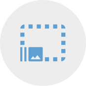

[](https://www.nuget.org/packages/AssetMan)

[](https://dev.azure.com/kimbirkelund/oss/_build/latest?definitionId=12&branchName=develop)
[](https://dev.azure.com/kimbirkelund/oss/_build/latest?definitionId=12&branchName=develop)

[](https://dev.azure.com/kimbirkelund/oss/_build/latest?definitionId=12&branchName=main)
[](https://dev.azure.com/kimbirkelund/oss/_build/latest?definitionId=12&branchName=main)

Resize Xamarin.Android and Xamarin.iOS assets automatically at build time.

## Installation and usage

Available on [nuget.org](https://www.nuget.org/packages/AssetMan/). Simply install package into the platform projects.

Prerelease versions are available [here](https://dev.azure.com/kimbirkelund/oss/_packaging).

The easiest way is to use **AssetMan** from its build task. Simply add the package reference to your **Xamarin.iOS**, **Xamarin.Android** or **Universal Windows Platform** project and add a `Config.assets.json` configuration file at the root of your project.

`Config.assets.json`

```json
{
  "Platform": "<iOS|Android>",
  "Input": [
    "<input folder path relative to this file, containing all the source hd assets>"
  ],
  "Output": "<output folder path relative to this file, where all the density assets are generated to>"
}
```

```json
{
  "Platform": "iOS",
  "Input": ["../AssetMan.Sample.Cli/Images/"],
  "Output": "Assets.xcassets"
}
```

In your high definition asset source folder, all `.png`|`.jpg` images should have a suffix qualifier indicating their original density. Here is the list of available qualifiers :

- `<name>.<ext>` : **1.00**
- `<name>@<value>x.<ext>` : **value**
- `<name>@ldpi.<ext>` : **0.75**
- `<name>@mdpi.<ext>` : **1.00**
- `<name>@hdpi.<ext>` : **1.50**
- `<name>@xhdpi.<ext>` : **2.00**
- `<name>@xxhdpi.<ext>` : **3.00**
- `<name>@xxxhdpi.<ext>` : **4.00**

Then simply build the project to generate your various assets (_with densities lower or equal to the original density_) to the output folder!

The generated files are automatically included in the project, so there is no need to do that manually. I'd also suggest setting up .gitignore to not include the generated files in source control. Currently files are not regenerated if they exist, even if the source asset is updated (this will be fixed).

## Platforms

### iOS

Assets are generated as asset catalog entries (`.imageset`).

### Android

Assets are generated inside qualified drawable sub folders (`drawable-hdpi`, `drawable-xhdpi`, ...).

## CLI

The standalone `.exe` CLI used by the build task is available from the `/tools` folder of the NuGet package.

## Under the hood

The tool uses [SkiaSharp](https://github.com/mono/SkiaSharp) to resize all images.

## Contributions

Contributions are welcome! If you find a bug please report it and if you want a feature please report it.

If you want to contribute code please file an issue and create a branch off of the current dev branch and file a pull request.

## Attributions

This is, initially, a rebranding of [Assetxport](https://github.com/dotnet-ad/Assetxport), released under MIT, with the intention of supporting and furthering the project.
